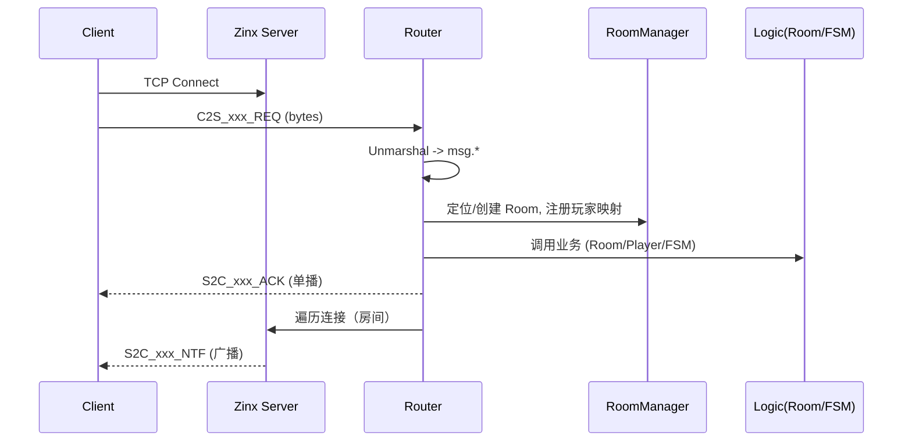
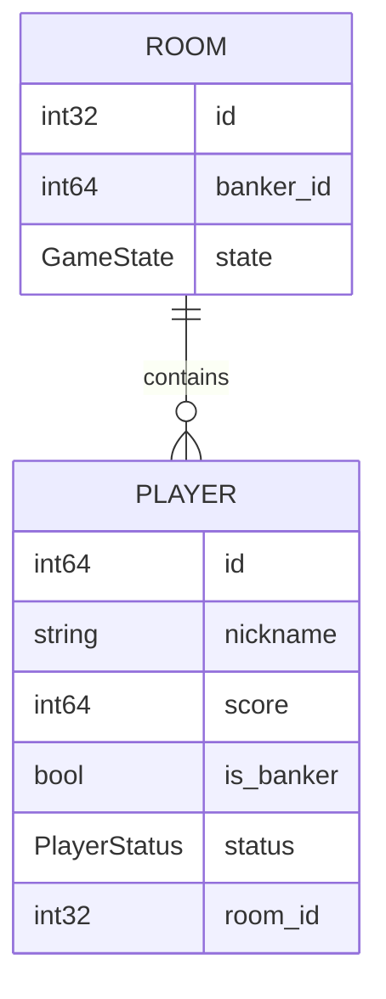
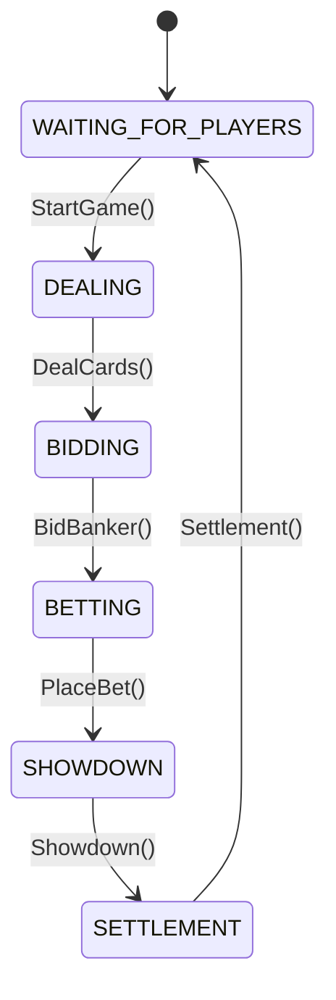
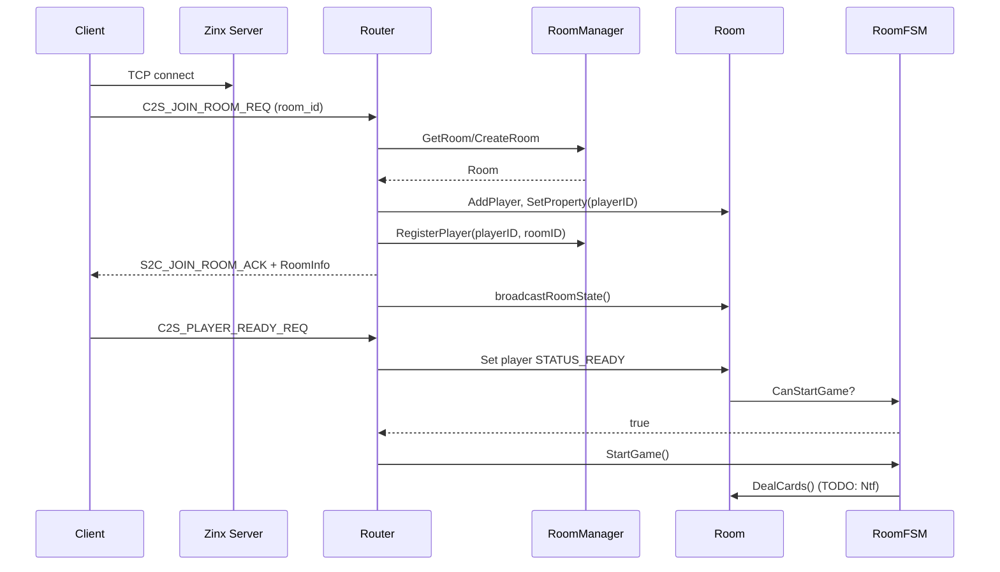
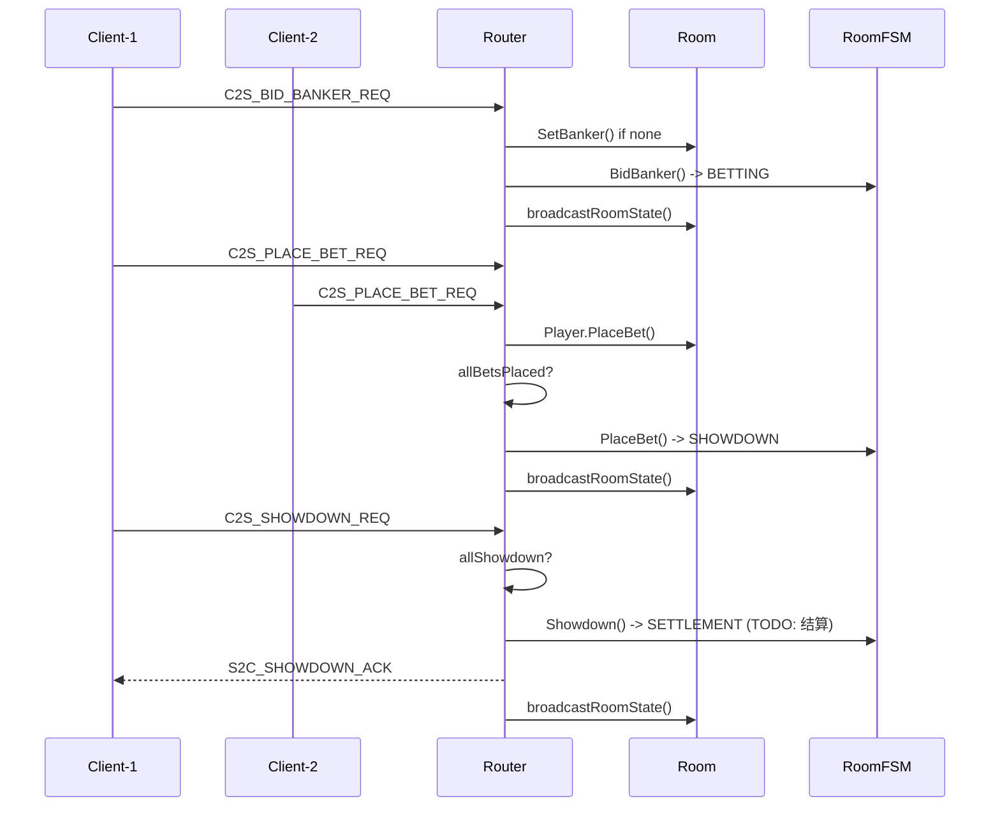

# xizexcample — 斗牛牛（NiuNiu）游戏服务器

一个基于 Zinx 的轻量实时游戏服务器示例，实现房间/玩家管理、游戏状态机与核心交互流程（加入、准备、抢庄、下注、摊牌等）。项目采用内存态管理，适合用于教学、原型与二次开发。

## 目录
- [特性](#特性)
- [架构概览](#架构概览)
- [快速开始](#快速开始)
- [配置](#配置)
- [协议与消息](#协议与消息)
- [项目结构](#项目结构)
- [开发指引](#开发指引)
- [测试](#测试)
- [路线图](#路线图)
- [许可证](#许可证)

## 特性
- 房间与玩家管理：创建/查询/删除房间、玩家注册与房间映射、断线标记与超时清理
- 游戏状态机：等待→发牌→抢庄→下注→摊牌→结算，具备基础转移规则
- 核心路由：加入、准备、抢庄、下注、摊牌等请求处理
- 协议定义：使用 Protobuf 定义消息结构与枚举，便于跨端协作
- 可扩展：业务规则（牌型/结算/广播）留有清晰 TODO，便于逐步完善

## 架构概览
- 入口：`main.go` 启动 Zinx 服务器，加载配置，注册路由与钩子
- 配置：`internal/conf` 读取 `conf/zinx.json`，提供全局 `AppConfig`
- 路由：`internal/router` 负责消息ID到处理器的映射与处理流程
- 业务：`internal/logic` 包含 `Player`、`Room`、`Deck` 与 `RoomFSM`
- 服务：`internal/server` 提供连接钩子与 `RoomManager` 单例
- 协议：`api/proto/game.proto` 定义消息结构，生成至 `internal/msg`

参考架构图见下文“附录：架构图”。

## 依赖关系与启动流程图

- **[启动流程]**
  - 从 `internal/conf/config.go` 读取 `conf/zinx.json` 到 `AppConfig`
  - 使用 `AppConfig` 配置 `zconf.GlobalObject`（`Host`、`TCPPort`）
  - 创建 Zinx 服务器实例：`znet.NewServer()`
  - 注册路由：`router.InitRouter(server)`（注册 101~106 消息）
  - 设置连接生命周期钩子：`server.SetOnConnStop(OnConnStop)`
  - 启动服务：`server.Serve()`

```mermaid
graph TD
    subgraph "启动流程"
        A[main.go] --> B{加载配置 internal/conf};
        B --> C{创建 Zinx 服务器};
        C --> D{初始化路由 internal/router};
        D -- 注册 Handler --> E[消息处理程序];
        E -- 调用业务逻辑 --> F[internal/logic];
        F -- 操作 --> G[Room/Player/Deck];
        C --> H{设置连接钩子 internal/server};
        C --> I[启动服务器 s.Serve()];
    end

    subgraph "组件依赖关系"
        main.go -- 依赖 --> internal/conf;
        main.go -- 依赖 --> internal/server;
        main.go -- 依赖 --> internal/router;
        internal/router -- 依赖 --> internal/logic;
        internal/logic -- 依赖 --> internal/msg;
    end
```

- **[消息流概览]**（请求从网络进入到业务处理与广播）



## 快速开始
### 依赖
- Go 1.25（go.mod 声明为 `go 1.25.1`）
- Protobuf 工具链（`protoc`）与 Go 插件（可选，只有在修改 `.proto` 时需要）

### 启动
```bash
go run ./...
```
默认监听 `0.0.0.0:8999`（可在配置中修改）。

### 构建
```bash
go build -o zinx-niuniu
```

## 配置
文件：`conf/zinx.json`
```json
{
  "Name": "ZinxServerApp",
  "Host": "0.0.0.0",
  "TCPPort": 8999,
  "MaxConn": 12000,
  "WorkerPoolSize": 10
}
```
加载逻辑：`internal/conf/config.go` 会以默认值初始化 `AppConfig` 并尝试读取 `conf/zinx.json`，启动时将 `AppConfig` 同步到 `zconf.GlobalObject`。

建议：
- 对齐 `zinx.json` 字段命名与 `AppConfig`（server_host/server_port）
- 增加环境变量覆盖机制（生产/测试环境区分）

## 协议与消息
- 源定义：`api/proto/game.proto`，`option go_package = "xizexcample/internal/msg"`
- 生成命令（示例）：`scripts/gen_proto.sh`

已注册的 C2S 路由（见 `internal/router/router.go`）：
- `101 C2S_JOIN_ROOM_REQ` → `JoinRoomHandler`
- `102 C2S_PLAYER_READY_REQ` → `PlayerReadyHandler`
- `103 C2S_BID_BANKER_REQ` → `BidBankerHandler`
- `104 C2S_PLACE_BET_REQ` → `PlaceBetHandler`
- `105 C2S_SHOWDOWN_REQ` → `ShowdownHandler`
- `106 C2S_LEAVE_ROOM_REQ` → `LeaveRoomHandler`（占位，需实现）

S2C Ack/Ntf 见 `api/proto/game.proto`，部分通知在路由中仍为 TODO（需完善广播）。

## 项目结构
```
api/
  proto/
    game.proto
conf/
  zinx.json
docs/
  ARCH.md
internal/
  conf/
    config.go
  logic/
    bull_logic.go
    deck.go / *_test.go
    player.go
    room.go
    room_fsm.go / *_test.go
  msg/
    game.pb.go
  pkg/
    logger/
  router/
    router.go
    join_room.go
    player_ready.go
    bid_banker.go
    place_bet.go
    showdown.go
    utils.go
  server/
    hooks.go
    room_manager.go / *_test.go
scripts/
  gen_proto.sh
specs/
  001-/
    spec.md
    data-model.md
    plan.md
    research.md
    tasks.md
    checklists/
  0_01-/
    quickstart.md
tests/
  e2e/
    *.go (占位/部分模拟)
  unit/
    (空)
main.go
go.mod / go.sum
Makefile
coverage.out
```

## 开发指引
- 修改协议后执行代码生成：
  ```bash
  bash scripts/gen_proto.sh
  ```
- 路由扩展：在 `internal/router/router.go` 增加消息ID映射，并在对应文件实现处理器 `Handle()`。
- 广播/同步：建议实现 `room.Broadcast(msgID, payload)` 并在 `router/*` 内调用，区分全房间广播与单播（自己）。

## 测试
- 运行测试：
  ```bash
  go test ./... -race -coverprofile=coverage.out
  go tool cover -func=coverage.out
  ```
- 当前状态：
  - 逻辑/状态机/房间/房管器具备单测
  - E2E 为占位（`join_game_test.go`、`betting_flow_test.go`），`reconnect_test.go` 使用 Mock 更接近处理器级集成
- 建议：
  - 补充 `router` 的处理器级单测（含非法请求、阶段校验）
  - 引入真实 TCP 客户端的 E2E 测试（编解码、时序、并发玩家）
  - 在 CI 中强制覆盖率阈值与 `-race`

## 路线图
- 实现斗牛牛牌型与结算规则（含 `CardPattern` 计算与 `S2C_GameResultNtf`）
- 完成所有 S2C 通知的广播实现与重连全量同步（`sendFullRoomState()`）
- 完善抢庄/下注的并发/校验（余额、限额、时序）
- 身份鉴权与真实 `player_id` 注入
- 指标与日志：结构化日志、Prometheus 指标、TraceID
- 资源治理：房间生命周期管理与定时器集中调度

## 许可证
未指定（请按业务选择开源许可证或内部协议）。

---

# 附录：可视化架构图

### 组件/模块依赖图
```mermaid
graph TD
  A[main.go] --> B[internal/conf]
  A --> C[internal/router]
  A --> D[internal/server]
  C --> E[internal/logic]
  E --> F[Room/Player/Deck/FSM]
  C --> G[internal/msg (protobuf)]
  D --> H[RoomManager]
  D --> I[OnConnStop Hook]
  H --> F
```

### 房间内实体关系（ER 简图）


### 状态机（FSM）


### 加入与准备流程时序


### 抢庄/下注/摊牌流程时序


---

## 项目状态评估报告

- **[功能完整性]**
  - **房间管理（FR-001）**: 已实现。`server.RoomManager` 支持 `CreateRoom()`/`GetRoom()`/`DeleteRoom()`、玩家注册/注销与玩家ID→房间ID映射（`RegisterPlayer()`/`UnregisterPlayer()`、`GetRoomByPlayerID()`）。对外“解散房间”路由未提供。
  - **玩家状态管理（FR-002）**: 已实现。`logic.Player` 管理在线/离线、状态、手牌、下注、是否庄家；`logic.Room.SetPlayerOffline()` 标记离线与断线时间。
  - **完整生命周期（FR-003）**: 部分实现。`logic.RoomFSM` 定义状态与有向转移（等待→发牌→抢庄→下注→摊牌→结算），`StartGame()`/`DealCards()`/`BidBanker()`/`PlaceBet()`/`Showdown()`/`Settlement()`已提供，但多数业务规则与消息广播留有 TODO。
  - **斗牛牛牌型规则（FR-004）**: 未实现。虽有 `CardPattern` 枚举（`game.proto`），服务端未计算牌型与结算。
  - **实时通信与请求处理（FR-005）**: 已实现基础处理。`internal/router` 已注册消息 101~106 路由，完成加入/准备/抢庄/下注/摊牌等主干流程；多处广播与错误处理仍有 TODO。
  - **内存态管理（FR-006）**: 已实现。房间、玩家、状态机、牌堆均在内存中维护。
  - **断线重连（FR-007）**: 部分实现。`JoinRoomHandler` 能识别离线玩家并重连、恢复连接与状态同步（`sendFullRoomState()` 待实现）。`server.OnConnStop()` 将玩家标记离线并注销映射。

- **[测试完备性]**
  - **单元测试**: `internal/logic/deck_test.go`、`room_fsm_test.go`、`room_test.go`，`internal/server/room_manager_test.go` 基础覆盖良好。`tests/unit/` 为空，可补上针对各 `router` 的单测与异常场景。
  - **集成/端到端测试**: `tests/e2e/` 多为 Skip 占位（加入、下注、摊牌等）；`reconnect_test.go` 使用 Mock 连接/请求，验证了断线重连路径（接近处理器级集成）。
  - **覆盖率与执行**: 根目录存在 `coverage.out`，但无 CI 配置与阈值要求。建议引入 CI（含 `-race`）、并发房间/玩家压力与覆盖率门槛。

- **[主要风险与优化建议]**
  - **规则与结算缺失**: 实现 `CardPattern` 计算、比牌与结算，产出 `S2C_GameResultNtf` 并对齐分数变更与倍数规则。
  - **广播机制统一**: 为 `Room` 增加 `Broadcast()` 能力，完善 `S2C_*_Ntf`，区分全局广播/单播/他人可见内容；实现重连全量同步 `sendFullRoomState()`。
  - **身份鉴权**: 目前用 `connID` 充当玩家ID，存在冒名顶替风险。引入鉴权/签名与真实 `player_id` 注入。
  - **并发一致性**: 抢庄/下注需并发安全与幂等控制，补齐倒计时/截止触发、余额校验、限额策略。
  - **资源治理**: 每房间 goroutine 定时清理，规模化需集中调度与配置化，避免 goroutine 膨胀。
  - **协议契约对齐**: 建立“消息契约对齐表”，逐项核对 `game.proto` 与 `router` 实装；完善错误码。
  - **可观测性**: 统一结构化日志、上下文标识（房间/玩家/traceID）、指标（QPS/延迟/玩家数/房间数/消息分布）。

---

## 架构与实例关系分析总结

- **[核心实体]**
  - **`logic.Player`**: 管理玩家状态/在线性/下注/手牌/连接。
  - **`logic.Room`**: 聚合 `Player`/`Deck`/`RoomFSM`，提供发牌、设庄、离线清理等能力。
  - **`logic.RoomFSM`**: 状态主导业务阶段，保证阶段有序与校验。
  - **`server.RoomManager`**: 全局单例，负责房间集合与玩家-房间映射。
  - **`router.*Handler`**: 协议入口，反序列化请求、校验状态、调用业务、回 Ack/广播。
  - **`internal/msg`**: 协议生成代码，承载消息契约。

- **[关系与数据流]**
  - `main.go` → `conf.AppConfig` → `znet.Server` → `router.InitRouter()` → `server.OnConnStop()` → `Serve()`。
  - 请求进入路由 → 反序列化为 `msg.*` → `RoomManager` 定位房间/玩家 → `Room/Player/FSM` 执行业务 → Ack 单播/通知广播。
  - 断开连接 → `OnConnStop` 标记离线并解除映射 → 房间侧清理定时器持续回收。

- **[关键流程]**
  - 加入房间、准备、抢庄、下注、摊牌/结算对应 `router` 与 `RoomFSM` 阶段转换，状态约束生效；重连恢复通过房管器映射和房间状态全量同步（待补齐）。

- **[建议落地优先级]**
  - P0: 结算与牌型规则、统一广播、重连全量同步。
  - P1: 身份鉴权、并发安全与幂等、错误码与协议对齐表。
  - P2: 可观测性、资源治理、CI/CD 与覆盖率阈值。
