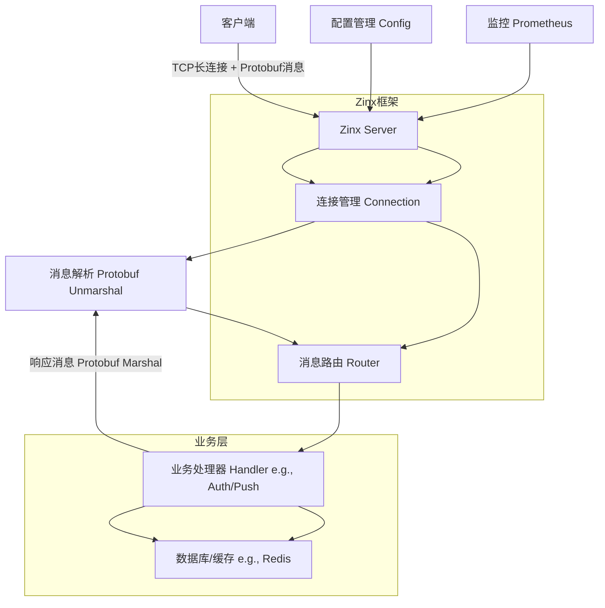

# 基于Zinx和Protobuf的长连接服务架构设计与开发规划

## 1. 技术选型与环境搭建

### 技术选型
- **Zinx框架版本**：v1.0（最新稳定版本，支持高并发TCP服务器开发，提供连接管理、消息路由和工作池等核心功能）。
- **Protobuf协议版本**：v32.1（最新版本，提供高效的二进制序列化，支持跨语言数据交换，适用于长连接场景下的消息传输）。
- **Golang版本**：1.25（最新版本，支持更优化的垃圾回收和并发性能，提升服务稳定性）。
- **依赖管理工具**：Go Modules（Golang内置，支持版本控制和依赖隔离）。
- **其他工具**：Protobuf编译器（protoc）用于生成Golang代码；日志库使用Zinx内置的日志模块，或集成第三方如zap；测试工具如Go的testing包。

### 环境搭建
1. **安装Golang**：
   - 下载并安装Go 1.25。从官网（https://go.dev/dl/）下载对应平台的安装包。
   - 验证安装：执行命令 `go version`，输出应为 `go version go1.25`。

2. **初始化项目并安装Zinx**：
   - 创建项目目录：`mkdir long-conn-service && cd long-conn-service`。
   - 初始化Go Modules：`go mod init github.com/yourusername/long-conn-service`。
   - 安装Zinx：`go get github.com/aceld/zinx@v1.0`。

3. **安装Protobuf编译器（protoc）和Go插件**：
   - 安装protoc：使用包管理器安装，例如在Linux/macOS上执行 `brew install protobuf`（macOS）或 `apt install protobuf-compiler`（Ubuntu）。
   - 安装Go插件：`go install google.golang.org/protobuf/cmd/protoc-gen-go@latest`。
   - 验证：执行 `protoc --version`，输出应为 `libprotoc 32.1`；执行 `protoc-gen-go --version`，确认插件可用。

4. **项目结构建议**：
   ```
   long-conn-service/
   ├── go.mod
   ├── go.sum
   ├── main.go          // 入口文件
   ├── conf/            // 配置目录（如zinx.json）
   ├── proto/           // Protobuf定义文件
   │   └── messages.proto
   ├── routers/         // 消息路由器
   ├── handlers/        // 业务逻辑处理器
   ├── utils/           // 工具函数
   └── logs/            // 日志输出目录
   ```

这些命令可直接复制执行，确保GOPATH和GOROOT正确配置。

## 2. 架构设计

### 整体架构描述
服务采用Zinx框架作为核心，处理TCP长连接。客户端通过Protobuf序列化消息与服务器通信。架构分为以下模块：
- **连接管理模块**：使用Zinx的Connection处理连接建立、保持和断开，支持心跳检测。
- **消息路由模块**：基于消息ID路由到特定处理器。
- **业务逻辑模块**：处理具体业务，如用户认证和消息推送，使用goroutine池并发执行。
- **数据传输层**：Protobuf负责消息序列化和反序列化。
- **配置与监控**：Zinx配置管理日志和性能参数，集成Prometheus监控。

数据流向：客户端发送Protobuf消息 → Zinx服务器接收并解析 → 路由分发 → 业务处理 → 返回响应。

### 架构图


## 3. Protobuf接口定义

### 消息结构设计
设计核心消息，包括通用请求/响应，以及业务特定消息。所有消息包含消息ID、长度和数据体，便于Zinx解析。

示例Protobuf文件（proto/messages.proto）：
```proto
syntax = "proto3";

package messages;

option go_package = "github.com/yourusername/long-conn-service/proto";

// 通用请求消息
message Request {
  uint32 msg_id = 1;      // 消息ID，用于路由
  bytes data = 2;         // 业务数据
}

// 通用响应消息
message Response {
  uint32 code = 1;        // 响应码（0:成功）
  string message = 2;     // 响应信息
  bytes data = 3;         // 业务数据
}

// 用户认证请求
message AuthRequest {
  string username = 1;
  string password = 2;
}

// 用户认证响应
message AuthResponse {
  string token = 1;
}

// 消息推送请求
message PushRequest {
  string target_user = 1;
  string content = 2;
}

// 消息推送响应
message PushResponse {
  bool success = 1;
}
```

### 生成Golang代码
使用protoc编译：
- 命令：`protoc --go_out=. proto/messages.proto`
- 这将生成proto/messages.pb.go文件，包含结构体和序列化方法。

## 4. Zinx模块开发

### 连接管理
使用Zinx的Connection接口处理连接。设置最大连接数、心跳检测（默认10秒）和超时。

示例代码（main.go片段）：
```go
package main

import (
    "github.com/aceld/zinx/ziface"
    "github.com/aceld/zinx/znet"
)

func main() {
    // 创建服务器
    s := znet.NewServer("[Zinx V1.0]")  // 使用默认配置，或加载zinx.json

    // 配置心跳检测
    s.SetHeartBeatMax(10)  // 最大心跳间隔10秒

    // 添加路由等（见下文）

    // 启动服务器
    s.Serve()
}
```

连接钩子示例（在AddRouter前）：
```go
// 连接建立钩子
func OnConnStart(conn ziface.IConnection) {
    // 发送欢迎消息或其他初始化
    conn.SendMsg(0, []byte("Welcome to server"))
}

// 在服务器中注册
s.SetOnConnStart(OnConnStart)
```

### 消息路由
Zinx使用MsgID路由消息。设计路由表，将MsgID映射到处理器。

示例代码（routers/router.go）：
```go
package routers

import (
    "github.com/aceld/zinx/ziface"
    "github.com/aceld/zinx/znet"
)

// 基础路由器
type BaseRouter struct {
    znet.BaseRouter
}

// 认证路由 MsgID=1
type AuthRouter struct {
    BaseRouter
}

func (this *AuthRouter) Handle(req ziface.IRequest) {
    // 处理逻辑见业务部分
}

// 推送路由 MsgID=2
type PushRouter struct {
    BaseRouter
}

func (this *PushRouter) Handle(req ziface.IRequest) {
    // 处理逻辑见业务部分
}

// 在main中添加
s.AddRouter(1, &AuthRouter{})
s.AddRouter(2, &PushRouter{})
```

### 业务逻辑处理
针对用户认证（MsgID=1）和消息推送（MsgID=2）。

用户认证示例（handlers/auth.go）：
```go
// 在AuthRouter的Handle中调用
func HandleAuth(req ziface.IRequest) {
    // 解析Protobuf
    var authReq messages.AuthRequest
    if err := proto.Unmarshal(req.GetData(), &authReq); err != nil {
        // 返回错误响应
        resp := &messages.Response{Code: 1, Message: "Parse error"}
        data, _ := proto.Marshal(resp)
        req.GetConnection().SendMsg(1, data)
        return
    }

    // 业务逻辑：验证用户名密码（假设使用数据库）
    if authReq.Username == "user" && authReq.Password == "pass" {
        authResp := &messages.AuthResponse{Token: "jwt-token"}
        respData, _ := proto.Marshal(authResp)
        resp := &messages.Response{Code: 0, Data: respData}
        data, _ := proto.Marshal(resp)
        req.GetConnection().SendMsg(1, data)
    } else {
        // 失败响应
    }
}
```

消息推送示例（handlers/push.go）：
```go
// 在PushRouter的Handle中调用
func HandlePush(req ziface.IRequest) {
    var pushReq messages.PushRequest
    if err := proto.Unmarshal(req.GetData(), &pushReq); err != nil {
        // 错误处理
        return
    }

    // 业务逻辑：推送消息（假设使用Redis Pub/Sub）
    // redisClient.Publish("channel:"+pushReq.TargetUser, pushReq.Content)

    pushResp := &messages.PushResponse{Success: true}
    respData, _ := proto.Marshal(pushResp)
    resp := &messages.Response{Code: 0, Data: respData}
    data, _ := proto.Marshal(resp)
    req.GetConnection().SendMsg(2, data)
}
```

## 5. 性能优化与安全考虑

### 性能优化
- **连接池**：Zinx内置MaxConn配置，建议设置为12000（默认）。示例配置（zinx.json）：
  ```json
  {
    "MaxConn": 12000,
    "WorkerPoolSize": 100  // 协程池大小
  }
  ```
- **协程池**：Zinx使用WorkerPool处理任务，配置WorkerPoolSize=100，提升并发。示例：`s.SetWorkerPoolSize(100)`。
- **缓存**：集成Redis缓存认证token，减少数据库查询。示例：使用go-redis库，`go get github.com/redis/go-redis/v9`。

### 安全考虑
- **TLS加密**：在Zinx服务器启用TLS。生成证书：`openssl req -newkey rsa:2048 -nodes -keyout server.key -x509 -days 365 -out server.crt`。配置：修改Zinx启动为TLS监听（需自定义Zinx的Server以支持TLS）。
- **身份验证**：每条消息前添加token检查。在Handle中验证token（使用JWT库，如`go get github.com/golang-jwt/jwt/v5`）。
- **防止恶意攻击**：限流（使用golang.org/x/time/rate），IP黑名单。心跳机制防止僵尸连接。

## 6. 部署与监控

### 部署
- **容器化**：使用Docker部署。Dockerfile示例：
  ```
  FROM golang:1.25-alpine
  WORKDIR /app
  COPY . .
  RUN go build -o server main.go
  CMD ["./server"]
  ```
- 构建并运行：`docker build -t long-conn-service . && docker run -p 8999:8999 long-conn-service`。
- **生产环境**：使用Kubernetes部署，配置 replicas=3 实现高可用。

### 监控
- **监控指标**：连接数、消息吞吐、CPU/内存使用、错误率、心跳丢失。
- **工具推荐**：Prometheus + Grafana。
- 配置示例：在main.go集成Prometheus：
  ```go
  import "github.com/prometheus/client_golang/prometheus/promhttp"
  // 在main中
  go func() {
      http.Handle("/metrics", promhttp.Handler())
      http.ListenAndServe(":9090", nil)
  }()
  ```
- Grafana仪表盘监控Zinx指标（如通过自定义exporter暴露）。

## 7. 潜在问题与解决方案

- **连接泄露**：
  - 解决方案1：启用Zinx心跳机制，自动关闭超时连接。配置：`s.SetHeartBeatMax(5)`。
  - 解决方案2：监控连接数，超过阈值时拒绝新连接。使用Prometheus告警。

- **消息丢失**：
  - 解决方案1：实现消息确认机制（ACK），客户端重发未确认消息。
  - 解决方案2：使用Kafka作为消息队列缓冲，Zinx处理后入队。

- **性能瓶颈**：
  - 解决方案1：优化WorkerPoolSize，根据负载测试调整（e.g., 基准测试使用wrk工具）。
  - 解决方案2：分片部署，多实例负载均衡，使用Nginx代理。


  