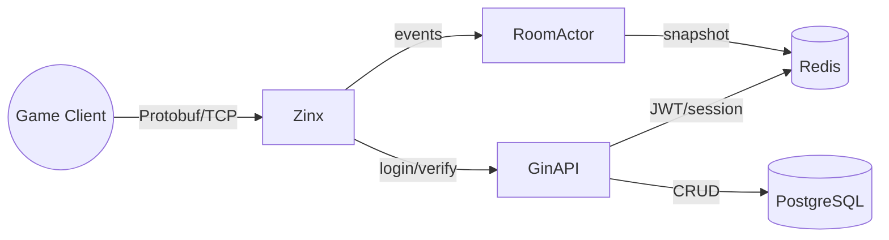
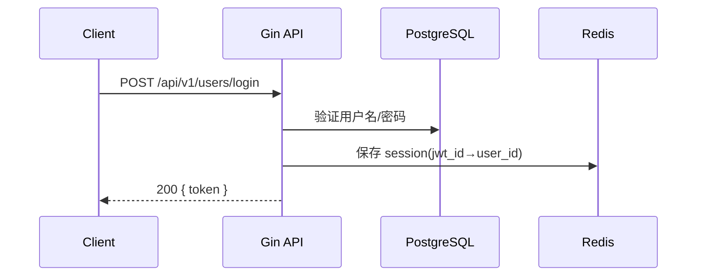
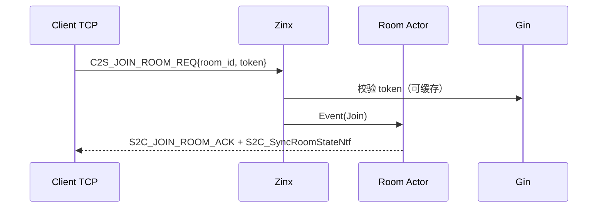

# 架构设计（Gin + Zinx + 微服务拆分）

更新时间：2025-10-11 22:22:24 +08:00

## 1. 总览

- **实时网关（Game Gateway）**：沿用 Zinx（TCP/Protobuf）。处理 C2S/S2C，路由到房间 Actor。
- **HTTP API（Gin）**：提供账户、好友、物品、支付等管理型接口。
- **房间服务（Room Service）**：每房间一个 goroutine（Actor），负责 FSM、计时器、广播与结算。
- **数据层**：PostgreSQL（关系数据）+ Redis（会话、快照、限流、幂等）。

## 2. 模块边界

- `gateway/`（可复用现有 `internal/router`）
  - 鉴权中间件（基于 JWT 校验）：在 JOIN 前校验；通过 `SetProperty("playerID")` 绑定连接。
  - 编解码：Protobuf（`internal/msg`）。
- `room/`（对局域）
  - 事件定义：Join/Ready/Bid/Bet/Showdown/Timeout 等。
  - Actor：`room.go` 持有 `chan Event`，串行处理写操作。
  - FSM：`room_fsm.go` 衔接阶段推进，计时器驱动 Timeout 事件。
  - 结算：调用 `bull_logic.go` 的 `CompareHands()`。
  - 广播：聚合消息后扇出到连接写队列（每连接独立 goroutine）。
- `api/`（Gin 服务）
  - Users：注册/登录/Me。
  - Friends：请求/接受/列表。
  - Inventory：查询/增减。
  - Payments：下单/回调（mock）。
- `pkg/`（通用）
  - `auth`（JWT）、`errors`（错误码）、`rate`（限流）、`codec`（JSON/Proto）、`logger`（结构化）。

## 3. 数据模型

- PostgreSQL（表与关键字段）
  - users(id PK, username unique, password_hash, nickname, created_at)
  - sessions(id PK, user_id FK, jwt_id unique, expires_at)
  - friends(id PK, user_id, friend_user_id, status, created_at)
  - inventories(id PK, user_id, item_id, quantity, updated_at)
  - payments(id PK, user_id, order_id unique, amount, channel, status, created_at)
  - ledgers(id PK, user_id, delta, reason, ref_id, created_at)

- Redis（键）
  - session:{jwt_id} → user_id (TTL)
  - room:{room_id}:snapshot → RoomInfo JSON
  - idemp:{user_id}:{seq} → 1 (TTL)
  - rate:{ip} / rate:{user_id}

## 4. 关键序列

- 登录（Gin）

- 加入房间（Zinx）

## 5. 非功能需求

- 可扩展：房间按 `room_id % N` 分片到不同进程/节点；一致性哈希路由。
- 可观测：日志字段化、Prometheus 指标（QPS/延迟/错误率/阶段停留时长）。
- 可靠性：限流与幂等、慢连接背压、断线重连快照。

## 6. 依赖与版本建议

- Gin（/gin-gonic/gin）：路由、中间件、验证。
- go-redis、pq/gorm（任选 ORM）
- JWT（github.com/golang-jwt/jwt/v5）
